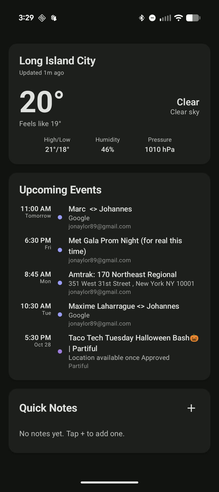
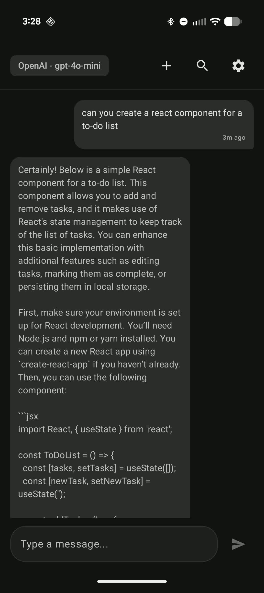
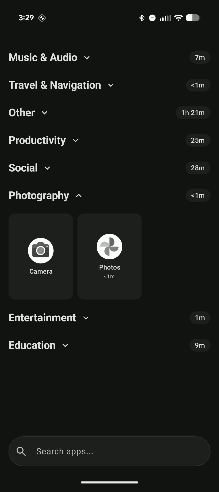

# Saint John

A minimalist Android launcher with LLM conversations, smart widgets, and organized apps—all on your home screen.

## Screenshots

<div align="center">
  
  
  
</div>

## Features

### AI Conversations, Natively
Access OpenAI, Anthropic Claude, and Google Gemini directly from your home screen. No context switching—talk to your AI right where you live.
- Streaming responses in real-time
- Multiple model support (GPT-5, Claude Sonnet, Gemini 2.5 Pro, and more)
- Conversation history and search
- Cancel mid-response

### Essential Widgets
Everything you need at a glance. Weather, calendar, and notes—beautifully designed and always accessible.
- Live weather with location-based updates (auto-refreshes every 30 minutes)
- Calendar events (tap to open in calendar, auto-updates)
- Quick notes with markdown support
- Material 3 design language

### Organized App Drawer
Keep your apps tidy with collapsible folders. Pull down to expand or collapse all—a gesture that feels natural.
- Collapsible folders for clean organization
- Pull-to-expand/collapse gesture
- Haptic feedback for interactions
- Alphabetically sorted
- Long-press for App Info/Uninstall
- Auto-detects newly installed apps

## Building

### Prerequisites

- Android Studio with embedded JDK (Java 21)
- Android SDK
- Gradle 8.13

### Build Steps

1. Set Java home to Android Studio's embedded JDK:
```bash
export JAVA_HOME="$HOME/Applications/Android Studio.app/Contents/jbr/Contents/Home"
```

2. Build the project:
```bash
./gradlew build
```

The APK will be generated at `app/build/outputs/apk/debug/app-debug.apk`

## Installing

### Install to Connected Device

1. Connect your Android device via USB or wireless ADB

2. Verify device connection:
```bash
adb devices
```

3. Install the APK:
```bash
adb install -r app/build/outputs/apk/debug/app-debug.apk
```

4. Launch the app:
```bash
adb shell am start -n com.jonaylor.saintjohn/.MainActivity
```

## Configuration

After installation:

1. Open the app and tap the Settings icon
2. Add your API keys for the LLM providers you want to use:
   - OpenAI API Key
   - Anthropic API Key
   - Google API Key
3. Select your preferred model from the model selector

## Project Structure

- `app/src/main/java/com/jonaylor/saintjohn/`
  - `presentation/` - UI layer (Jetpack Compose)
  - `domain/` - Business logic and models
  - `data/` - Data layer (repositories, API clients, database)
